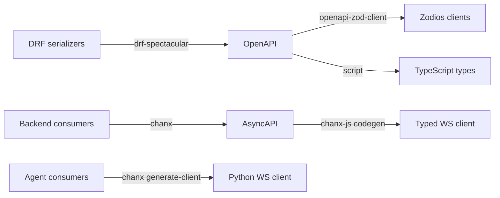

# Agent Graph Engineering

Companion repository for the **[Agent Graph Engineering](https://huynguyengl99.github.io/posts/agent-graph-engineering/the-stack-and-why-each-piece-is-there/)** blog series: building a typed, observable, controllable AI agent system with LangGraph, Pydantic AI, and chanx.

The series argues that your agent flow should be a **declared graph**, not a chain of `if/else` on an intent classifier. This repo is the working proof.

## What it is

A support desk with two surfaces that share one agent service:

- **The ticket thread** is customer-visible. A ticket arrives, the graph decides what to do with it - answer directly, search the knowledge base, escalate, or draft a reply - and posting that reply to the customer requires human approval.
- **The assistant chat** is the support agent's own. They can ask it anything, it answers freely with streaming, and nothing reaches a customer until they explicitly send a draft to a ticket, where the approval gate still applies.

One rule falls out of that split: **inside the conversation the assistant acts freely; leaving it requires a human.**

The domain was chosen so that the graph earns its place (real routing, not a two-node demo), the approval machinery solves a real problem (an irreversible action), and you can run the whole thing with only an LLM key. No OAuth, no third-party signups. With no key at all it still runs end to end on a scripted model, streaming included.

## Architecture

```
┌────────────┐   REST + WS   ┌────────────┐   typed WS   ┌──────────────┐
│  Frontend  │ ────────────▶ │  Backend   │ ───────────▶ │    Agent     │
│  (React)   │               │  (Django)  │   AsyncAPI   │  (FastAPI)   │
└────────────┘               └────────────┘              └──────────────┘
                                   │                            │
                              business data              graphs, tools,
                             auth, tickets               checkpoints
```

| Service    | Stack                                             | Port |
| ---------- | ------------------------------------------------- | ---- |
| `backend/` | Django 5.2, DRF, Channels, chanx, PostgreSQL      | 8000 |
| `agent/`   | FastAPI, LangGraph, Pydantic AI, chanx            | 8001 |
| `web/`     | React 19, Vite, Zodios, chanx-js, Tailwind        | 5173 |

The backend owns users, tickets, and the conversation as a person reads it. The agent service owns the graphs, the tools, the checkpoints, and the conversation as the *model* remembers it - Pydantic AI's own message history, which is not the same thing as a list of rows and is why both exist.

Every browser tab holds **one** WebSocket at `/ws/`. Tickets and conversations are *topics* on it, addressed per frame, so watching four resources is one connection rather than four. Publishing needs no consumer instance: `Topic.broadcast` is a classmethod, which is what a background task driving the agent requires.

## A note on the agent's boundary

The agent is internal: only the backend connects to it, never a browser. The
approval gate lives inside the graph, so anything that can open `/ws/` on the
agent can propose a tool call *and* approve it - network isolation is the primary control
and `ASSISTANT_AGENT_TOKEN` is the second. Unset means the agent accepts every
caller, which is why a fresh clone runs without one.

## How the two services stay in sync

Neither service mirrors the other. They hold different things, and only one
direction carries updates.

The agent owns **execution** state: which node runs next, the channel values, the
pending interrupt payload. That is a LangGraph checkpoint in Postgres, and it is
the only reason a resume works - rebuilding it by hand would mean reimplementing
the execution model.

The backend owns the **record**: messages, ticket events, and the two things a
reload needs to find - a drafted reply waiting for approval, and a proposed tool
call. Neither is a copy of graph state. They exist because the browser cannot ask
the agent what is waiting, and because a `PendingApproval` row is what rebuilds
the approval card after a refresh.

Updates travel one way. A node broadcasts an event on its topic, the backend is
subscribed, and its relay does two things with each one: writes what belongs in
the record, and fans it out to the browser group. So the backend learns what
happened by being told, not by reading the agent's tables, and the agent never
writes to the backend's.

Two consequences worth knowing:

- **The record is derived, so it can lag but not diverge.** A terminal event
  persists the turn; a parked run persists the card. A tool proposal is
  deliberately not a turn, because it only becomes one if it runs.
- **A missed event is asked for again.** A broadcast reaches whoever is subscribed
  at the time, so a restart mid-run used to leave a recoverable run and a message
  that never arrived. The agent now appends every event before publishing it and
  publishes the sequence it was stored at; the backend remembers the last sequence
  whose effect is durable, and asks for the rest when it subscribes. A replay
  starts *after* the cursor, which is what stops an event being applied twice, and
  the cursor moves in the same transaction as the row it records so a crash
  between the two cannot duplicate a reply.

## Everything is a generated contract

This is the core pattern, and the reason the three services can change independently without drifting apart:



Change a serializer or a WebSocket message, run `just gen`, and the compiler tells the frontend what broke. Your REST API has had this via OpenAPI for a decade. There is no reason your agent layer should not.

The backend models ticket activity as a **polymorphic** `TicketEvent` (`CommentEvent`, `StatusChangeEvent`, `AssignmentEvent`, `AIResponseEvent`), which surfaces in OpenAPI as a discriminated union and reaches the frontend as a TypeScript discriminated union. Adding an event type is one model, one serializer, one mapping entry, and a regeneration.

## Following along with the series

The series runs in tracks, and each post is pinned to a tag so you can check out the exact state being described:

| Track                | Tags                                                                              |
| -------------------- | --------------------------------------------------------------------------------- |
| Foundations          | `foundations-stack`, `foundations-types`                                           |
| Agent engineering    | `agent-typed`, `agent-prompts`, `agent-history`, `agent-tools`, `agent-routing`     |
| Graph flow           | `graph-basics`, `graph-state`, `graph-persistence`, `graph-interrupts`, `graph-subgraphs` |
| Realtime             | `realtime-websocket`, `realtime-streaming`, `realtime-scaling`                     |
| Contract             | `contract-schemas`, `contract-codegen`                                             |
| Auto UI from schema  | `ui-from-schema`                                                                   |
| Observability        | `observability-tracing`                                                            |
| Testing & evaluation | `testing-mocked-llm`, `evals-real-models`                                          |

```bash
git checkout graph-interrupts
```

`main` is always the latest state, and will be ahead of whatever post you are reading.

## Quick start

### Prerequisites

- Python 3.13+ with [uv](https://docs.astral.sh/uv/)
- Node.js 20+ with [pnpm](https://pnpm.io/)
- Docker and Docker Compose (PostgreSQL + Redis)
- [just](https://github.com/casey/just) (`brew install just`)

No API key is required to run it. With `OPENAI_API_KEY` unset the agent uses a
built-in scripted model: the graph, routing, streaming, and UI behave exactly
the same, only the reasoning is canned. Set a real key to get real answers.

### Setup

```bash
just setup           # env files, deps, Docker, migrations, generated clients, accounts
```

`just setup` gives each service the `.env` next to it, from its own
`.env.example`, waits for Postgres to accept connections before migrating, and
seeds two accounts - both with the password `demo-pass-123`:

| | |
| --- | --- |
| `demo@example.com` | staff. The console: the queue, internal notes, both gates, the assistant, graphs, traces. |
| `customer@example.com` | reports problems. The portal: their own tickets, and only the public half of each thread. |

They are deliberately two people. Sign in as one in a normal window and the
other in a private one, and you can watch a run from both sides at once: the
customer asks, the agent drafts, the draft waits for staff, and the approved
reply appears in the portal. Set `OPENAI_API_KEY` in `agent/.env` when you want
real answers.

### Run

```bash
just up          # all three, in the background, waiting until each answers
just status      # which are up
just logs a      # follow one of them (b backend, a agent, w web)
just down        # stop them and free the ports
```

Three ways to tidy up, in increasing order of violence:

| | |
| --- | --- |
| `just down` | stops the services. Postgres and Redis keep running. |
| `just infra-down` | stops those too. Data survives, so `just up` picks up where you left off. |
| `just reset` | throws the data away: database volumes, traces, eval runs. Re-migrates and re-seeds, so you end where `just setup` left you. Code and `.env` files are untouched. |

`just clean` is a different axis: it removes caches and generated clients, so it
wants a `just gen` afterwards.

Or one per terminal, when you are working on that service and want its output
in front of you:

```bash
just backend     # http://localhost:8000
just agent       # http://localhost:8001
just frontend    # http://localhost:5173
```

Backend endpoints:

- API: http://localhost:8000/api/
- Admin: http://localhost:8000/admin/
- Swagger UI: http://localhost:8000/api/schema/swg/
- AsyncAPI docs: http://localhost:8000/api/asyncapi/docs/

### Driving it

Two surfaces, two different relationships with the agent. The confusing part is
that both are "chat", so it is worth being explicit about which is which.

**The ticket thread is the customer conversation.** The agent drafts replies *to
the customer*, and only the customer asking something starts a run - a staff note
is addressed to colleagues, and a staff reply has already answered. Every draft
stops at the approval gate before it is posted.

**The Assistant is your own thread.** Internal, staff-only, never visible to a
customer, so there is no gate on what it says. Opening it from a ticket with
**Ask the assistant** carries that ticket as context and gives you **Send to
ticket**, which hands the answer to the ticket's own gate. Opening one from the
Assistant tab has no ticket attached - a scratchpad, with nowhere to send an
answer.

A walk through both, with the two accounts in two windows:

1. As the customer, report a problem and add a message. The console shows the
   classification and routing decision as they happen.
2. As staff, watch it park at the gate. Edit the draft, then approve: your text
   is what gets sent, not the model's. Reload while it is parked - the draft is
   persisted, not held in the tab.
3. As staff, add an **internal note**. Nothing runs: it was not addressed to the
   agent. It is read the next time one does, and the answer prompt says to use
   what it means without quoting it.
4. In the Assistant, ask for something irreversible - *"refund the duplicate
   29.00 charge for demo@example.com"*. It parks on a card whose form is
   generated from the tool's schema. Correct the amount and approve: the
   corrected value is what runs.
5. Open **Traces**. One tree per run, model calls nested under the node that
   made them, and what it cost.

### Regenerate clients after a contract change

```bash
just gen               # everything
just gen-frontend      # OpenAPI + AsyncAPI to TypeScript
just gen-agent-client  # agent AsyncAPI to Python client
```

Each generator reads a live schema, so it starts the service it reads from if
that service is not already up.

## Testing

```bash
just test    # backend, agent, and web suites
just check   # every project's checks in parallel
just fix     # the same set, writing the fixes it can
```

`just check` runs twelve checks at once and prints a summary, then the output of
only the ones that failed - a change that breaks two projects should not take
two runs to find. `just check ba` narrows it to the backend and the agent, and
`just check -e w` excludes the web app.

Python is checked twice, by mypy and by pyright, because they disagree
usefully: mypy understands Django through django-stubs, and pyright caught a
non-exhaustive `match` and a dead function that mypy passed over. Each one's
config turns off the rules that report the framework rather than this code.

Agent tests mock the LLM at the HTTP layer rather than stubbing Pydantic AI, so the real pipeline runs: SSE parsing, tool call assembly, streaming, and validation. Web tests swap only the socket, through chanx-js's `socketFactory`, so the client's framing and routing run for real. Evals against real models live separately and never run in CI, because they cost money.

## Containers

```bash
just images      # build the three images
just app-up      # run them on top of the infrastructure, on http://localhost:8080
just app-down
```

Three images built from the repo root, because the uv and pnpm locks are
workspace locks. The web image is nginx serving the built app and proxying
`/api`, `/ws`, `/admin` and `/static` to the backend, because the app resolves
both its API and its socket from `location.host`: same origin means no CORS and
no build-time base URL to get wrong per environment.

The agent publishes no port. Only the backend calls it, and nginx proxies just
its two read-only documentation paths, `/agent/graphs` and `/agent/asyncapi`,
with the shared token added server side so the browser never holds it. Traces are
not among them: those go through the admin, behind staff auth.

Building the images is how four things got found, all of them invisible in
development because the workspace shares one virtualenv:

- `daphne` was in `INSTALLED_APPS` and in the dev dependency group, so a
  production install could not import settings at all. It is only there so
  `runserver` speaks ASGI, and granian does not need it.
- The backend used `httpx` without declaring it, and the agent used `psycopg`
  and `redis` without declaring them. Each was satisfied by a sibling package in
  the shared venv.
- Browsers send `Origin` on form posts and Django checks it, so the admin login
  failed behind the proxy with a bare "CSRF verification failed". Only in a
  browser: `curl` sends no `Origin`, so it passed. `CSRF_TRUSTED_ORIGINS` has to
  name the app's origin rather than the backend's.

## Status

Work in progress, tracking the series as it publishes.

Working end to end, with nothing mocked in `just e2e`:

- **One ticket, two audiences.** A customer's message is persisted, fanned out
  over the ticket channel, handed to the agent over a typed WebSocket, and the
  classification and decision stream back live. The same graph answers the team
  privately on the same ticket.
- **Who is answering is a state the ticket carries.** The agent by default, a
  person once the agent escalates or someone replies to the customer, and back
  again through a button that introduces the change to the customer in a
  person's own words.
- **Two human gates.** A drafted reply parks before it reaches a customer; a
  tool call parks before it runs. Both survive a reload, and both resume on a
  different socket than the one that started the run.
- **The agent reasons out loud.** Structured output arrives in pieces, so the
  reasoning behind a branch is read while it is written, then kept on the
  ticket - for the team only, including on runs a customer started.
- **Nothing half-written reaches a customer.** A value the model could not fill
  is written `{{like this}}`, and the agent's prompt, the backend and the
  browser all refuse to publish text that still has one.
- Postgres checkpointing, at-most-once execution for irreversible tools,
  guardrails on both sides of the model, evals, and per-run tracing.

Not built yet: tools on a customer-facing run (the gate parks on a reviewer and
the customer's half of the ticket has nowhere to show it), context budgeting for
long conversations, and spend caps - cost is measured, not enforced.

## Graphs and subgraphs

One parent and three subgraphs composed into it as nodes:

| Graph | Kind | Why |
|---|---|---|
| `support` | parent | one message worked to an answer, for whoever is reading |
| `knowledge` | subgraph | it loops, and it is reached from more than one branch |
| `delivery` | subgraph | the only route to a customer, and the only irreversible step |
| `tool` | subgraph | propose a tool, clear it with a human, then run it |

It used to be two parents - `triage` for the customer and `chat` for the team -
which classified or routed, reached for the same knowledge base, and settled on
an answer, twice, in two files of the same length. They are one graph now, and
**the audience is a field on the context** rather than a second copy of the
graph. It decides three things: whether the ticket is graded, which capabilities
the decider is even offered, and whether the reply leaves through the delivery
gate instead of going straight back.

That last point is enforced by the output schema rather than by asking the model
nicely. Answering the customer there are no tools to reach for; answering the
team there is nobody to escalate to. A branch the model cannot name is one it
cannot take.

`GET /graphs/support.mermaid` renders the graph **from the compiled object**, so
the picture cannot disagree with the code. `xray=true` (the default) expands
the subgraphs inline; `xray=false` shows them as single boxes. The UI renders
these at `/graphs`.

## End-to-end

```bash
just seed       # the two accounts and some tickets
just e2e        # with all three services running
```

One pass through the product with **nothing mocked**: real Django, real agent,
real models, real browser. Kept out of `just test` because it writes to the dev
database and spends tokens.

It earns its place by catching what the mocked suites structurally cannot - a
Zodios client that threw on import, a create endpoint that returned no `id`,
a dependency upgrade that changed how models are constructed. Run it after any
of those.

## Human in the loop

Two things wait for a person, for different reasons.

A **drafted reply** parks at `delivery.await_approval`: the reviewer can edit
the text, approve, or reject, and nothing reaches the customer until they do.

A **tool call** parks at `tool.gate` *before it runs*. The reviewer sees the
tool and the arguments the model chose, and can approve, **correct the
arguments**, or cancel - correcting £29 to £9 means £9 is what gets refunded.
Underneath, `@wrap_tool` refuses an approval-marked tool that arrives without
`approved=True`, so a mis-wired graph fails closed rather than spending money.

Approval is not the end of the risk. LangGraph checkpoints *after* a node
returns, so a process killed mid-refund re-runs that node on resume and refunds
twice. A ledger keyed on the thread and the checkpoint namespace claims the call
before it is made and records the result after, so the second attempt returns the
first one's result. If the process dies between those two, nobody can know
whether the money moved, so the run says exactly that and asks a person to check
rather than guessing.

## Forms generated from a schema

One form engine, two sources of schema. The REST schemas are already Zod,
generated from the OpenAPI document. A tool's arguments arrive over the
WebSocket as JSON Schema, derived by the agent from the function's own
signature, and `lib/zodFromJsonSchema` converts them. `AutoForm` reads either
one for its fields, their types, which are required, their defaults and their
validation, so a form cannot ask for something the server or the tool will
reject.

That is what makes the tool gate work for a tool nobody wrote a form for: add a
tool to the agent and it is reviewable on its next proposal. The same engine
renders ticket creation and the model preferences at `/settings`, from
`TicketCreateRequest` and `ModelPreferenceRequest`.

## Choosing the models

Purposes are system config and the models filling them are user config, which
is what keeps provider independence real rather than theoretical. `/settings`
writes a preference per purpose; unset purposes fall through to the
deployment default. `provider:name` is validated server-side, and the field
error lands on the field.

## Guardrails

Two guards with different jobs, both in `agent/assistant/guardrails/`:

- **Input.** Customer-written ticket fields are fenced as data with an explicit "never as instructions" boundary, and the fence is stripped from the text so it cannot be closed from inside. Known injection shapes are *recorded, never blocked* - a desk that refuses tickets containing "ignore" is broken, and a warning everyone learns to skip is worse than none.
- **Output.** A `screen` node between the drafted answer and the approval gate. A leaked credential, another ticket's id, or the prompt recited back stops the draft before a reviewer is asked. A machine check ahead of the human one.

## Evals

```bash
just evals                              # the whole golden set
just evals guardrail                    # names matching "guardrail"
just evals-compare scripted openai_gpt-4o
```

Scenarios live in `agent/evals/scenarios/*.yaml`. Deterministic checks decide by majority across trials; prose criteria go to a cascade judge that runs free substring checks first and a model only when it must.

It runs with **no API key**: the scripted model keeps the deterministic checks real, unassessed criteria are reported as *skipped* rather than scored, and runs are labelled by the model that actually ran. Cost comes from the spans the tracer already collects, and a model with no price table reports its tokens with `priced: false` rather than a misleading $0.00.

## Observability

Every graph node opens a span and Pydantic AI nests its model calls underneath, so one run reads as a tree rather than a list of completions. It is the **Traces** tab in the console, beside Graphs: whoever asks why it answered that is the person who just watched it answer, and they are already there.

The agent serves the spans as JSON and the console renders them. It also decides which of a span's attributes are worth reading - which OpenTelemetry and Pydantic AI keys are noise is knowledge about the tracer, not about the page - so the rest collapse behind a count and expand on demand.

Spans go to a file per run under `ASSISTANT_TRACE_DIR`, and to an OTLP collector when `OTEL_EXPORTER_OTLP_ENDPOINT` is set. Both, not either: the files are the graph-shaped view, and a collector is where you keep things and compare runs. There is a test with a fake collector proving the request lands with its auth header intact.

### Traces carry the prompt

`gen_ai.input.messages` holds the customer's own words, because that is what was sent to the model. Two consequences:

- The files stay on the machine that produced them and keep everything. Seeing what the model was actually sent is the reason to keep a trace.
- `ASSISTANT_TRACE_REDACT_EXPORTS=true` strips message bodies on the way to a collector, leaving the shape: which node, how long, which model, what it decided, what it cost. Off by default, because a dashboard showing `[redacted]` everywhere is not worth having. Turn it on when the collector is somewhere you do not control.

Node spans record what the node decided, not what it wrote. Short scalars and the class name of a typed output; prose is skipped by length, so a drafted reply never reaches the trace store.

### Taking this to production

Files per run are the right shape for traces, and object storage is the same shape: write-once, read-rarely, always read by run. No index to maintain, nothing to vacuum, and retention becomes a lifecycle rule on the bucket rather than a cleanup job you write.

Two things to settle before swapping the backend, because neither is a detail:

**Appending does not exist.** S3 has no append, and GCS has `compose`, which concatenates objects rather than extending one. Writing a line per span as it finishes works on a local disk and does not port. The options, in rough order of how well they hold up:

| Approach | Crash safety | Cost |
|---|---|---|
| Local file as a write-ahead log, upload once at run end | spans survive a crash locally | one PUT per run |
| Rewrite the whole object per span | nothing lost | N PUTs, each rewriting a growing blob |
| One object per span | nothing lost | many small objects, read is list plus N gets |
| Buffer in memory, write at run end | a crash loses the whole run | one PUT per run |

The last is the tempting one and the worst, because a crashed run is exactly when the trace is worth having.

**The key layout decides whether erasure is possible.** Retention is free either way. Erasure is not: `traces/<run-id>.json` makes "delete everything about this customer" a full scan, while a prefix you can list by makes it a list and delete. That choice is cheap now and expensive once the bucket is full. Redacting at write time is cheaper still, because there is then little to erase.

## License

MIT
