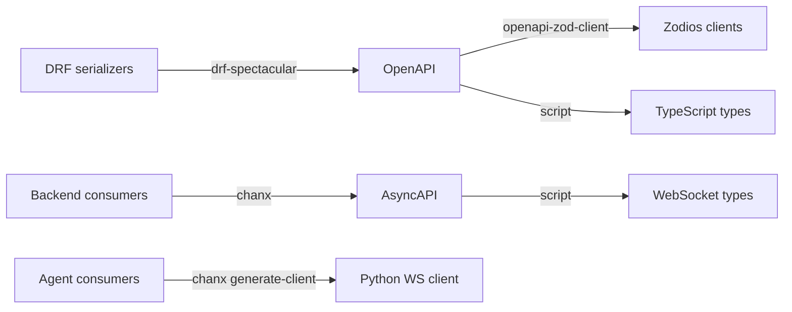

# Agent Graph Engineering

Companion repository for the **[Agent Graph Engineering](https://huynguyengl99.github.io/posts/agent-graph-engineering/the-stack-and-why-each-piece-is-there/)** blog series: building a typed, observable, controllable AI agent system with LangGraph, Pydantic AI, and chanx.

The series argues that your agent flow should be a **declared graph**, not a chain of `if/else` on an intent classifier. This repo is the working proof.

## What it is

A support ticket triage assistant. A ticket arrives and the agent decides what to do with it: answer directly, search the knowledge base, escalate to a human, or draft a reply. Posting a reply to the customer requires human approval. Searching the knowledge base does not.

The domain was chosen so that the graph earns its place (real routing, not a two-node demo), the approval machinery solves a real problem (an irreversible action), and you can run the whole thing with only an LLM key. No OAuth, no third-party signups.

## Architecture

```
┌────────────┐   REST + WS   ┌────────────┐   typed WS   ┌──────────────┐
│  Frontend  │ ────────────▶ │  Backend   │ ───────────▶ │    Agent     │
│  (React)   │               │  (Django)  │   AsyncAPI   │  (FastAPI)   │
└────────────┘               └────────────┘              └──────────────┘
                                   │                            │
                              business data              graphs, tools,
                             auth, tickets               checkpoints
```

| Service    | Stack                                             | Port |
| ---------- | ------------------------------------------------- | ---- |
| `backend/` | Django 5.2, DRF, Channels, chanx, PostgreSQL      | 8000 |
| `agent/`   | FastAPI, LangGraph, Pydantic AI, chanx            | 8001 |
| `web/`     | React 19, Vite, TanStack Router, Zodios, Tailwind | 5173 |

The backend owns users, tickets, and history. The agent service owns the graphs, the tools, and the checkpoints, and talks to nobody's database but its own.

## Everything is a generated contract

This is the core pattern, and the reason the three services can change independently without drifting apart:



Change a serializer or a WebSocket message, run `just gen`, and the compiler tells the frontend what broke. Your REST API has had this via OpenAPI for a decade. There is no reason your agent layer should not.

The backend models ticket activity as a **polymorphic** `TicketEvent` (`CommentEvent`, `StatusChangeEvent`, `AssignmentEvent`, `AIResponseEvent`), which surfaces in OpenAPI as a discriminated union and reaches the frontend as a TypeScript discriminated union. Adding an event type is one model, one serializer, one mapping entry, and a regeneration.

## Following along with the series

The series runs in tracks, and each post is pinned to a tag so you can check out the exact state being described:

| Track                | Tags                                                                              |
| -------------------- | --------------------------------------------------------------------------------- |
| Foundations          | `foundations-stack`, `foundations-types`                                           |
| Agent engineering    | `agent-typed`, `agent-prompts`, `agent-history`, `agent-tools`, `agent-routing`     |
| Graph flow           | `graph-basics`, `graph-state`, `graph-persistence`, `graph-interrupts`, `graph-subgraphs` |
| Realtime             | `realtime-websocket`, `realtime-streaming`, `realtime-scaling`                     |
| Contract             | `contract-schemas`, `contract-codegen`                                             |
| Auto UI from schema  | `ui-from-schema`                                                                   |
| Observability        | `observability-tracing`                                                            |
| Testing & evaluation | `testing-mocked-llm`, `evals-real-models`                                          |

```bash
git checkout graph-interrupts
```

`main` is always the latest state, and will be ahead of whatever post you are reading.

## Quick start

### Prerequisites

- Python 3.13+ with [uv](https://docs.astral.sh/uv/)
- Node.js 20+ with [pnpm](https://pnpm.io/)
- Docker and Docker Compose (PostgreSQL + Redis)
- [just](https://github.com/casey/just) (`brew install just`)

No API key is required to run it. With `OPENAI_API_KEY` unset the agent uses a
built-in scripted model: the graph, routing, streaming, and UI behave exactly
the same, only the reasoning is canned. Set a real key to get real answers.

### Setup

```bash
cp .env.example .env
# edit .env and set OPENAI_API_KEY

just setup           # install deps, start Docker, migrate, generate clients
just createsuperuser
```

### Run

Three terminals:

```bash
just backend     # http://localhost:8000
just agent       # http://localhost:8001
just frontend    # http://localhost:5173
```

Backend endpoints:

- API: http://localhost:8000/api/
- Admin: http://localhost:8000/admin/
- Swagger UI: http://localhost:8000/api/schema/swg/
- AsyncAPI docs: http://localhost:8000/api/asyncapi/docs/

### Regenerate clients after a contract change

```bash
just gen               # everything
just gen-frontend      # OpenAPI + AsyncAPI to TypeScript (needs backend running)
just gen-agent-client  # agent AsyncAPI to Python client (needs agent running)
```

## Testing

```bash
just test    # backend tests
just check   # mypy + ruff + django check + frontend typecheck
just lint    # lint all workspaces
```

Agent tests mock the LLM at the HTTP layer rather than stubbing Pydantic AI, so the real pipeline runs: SSE parsing, tool call assembly, streaming, and validation. Evals against real models live separately and never run in CI, because they cost money.

## Status

Work in progress, tracking the series as it publishes.

Working end to end: post a comment in the browser and the backend persists it,
fans it out over the ticket channel, hands the ticket to the agent over a typed
WebSocket, and streams the classification and the routing decision back live.
The drafted reply then parks at a human approval gate. Approve, edit, or reject
it; only an approved reply runs the irreversible send and becomes a ticket
event. The paused run lives in the graph's checkpointer keyed by ticket, so the
decision can arrive on a different socket than the one that started the run.

Every run is traced. `GET /traces/{ticket_id}` returns the route the graph
actually took, with each model call nested under the node that made it:

```
node.classify (22.2ms)
  agent run
    chat gpt-4o-mini
node.decide (20.1ms) {decision: SearchKnowledgeBase}
  agent run
node.search_kb (0.2ms) {query: "invoice billing refund", articles: 2}
node.respond (6.9ms) {grounded: true}
```

That is a tree, not a list of completions, and the branch not taken leaves no
span. Set `OTEL_EXPORTER_OTLP_ENDPOINT` to forward the same spans to Langfuse,
Jaeger, or any OTLP collector; leave it unset and they stay in memory.

Not built yet: evals, and a Postgres checkpointer (the current one is in-memory,
so a paused run does not survive an agent restart).

## License

MIT
