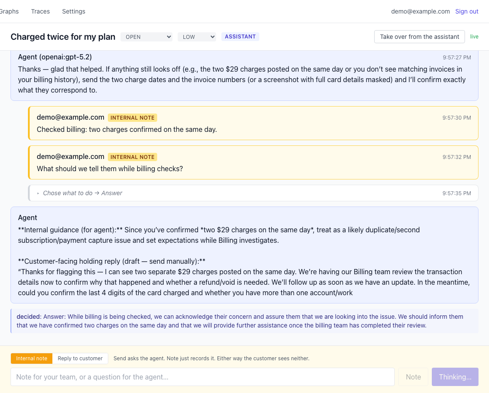
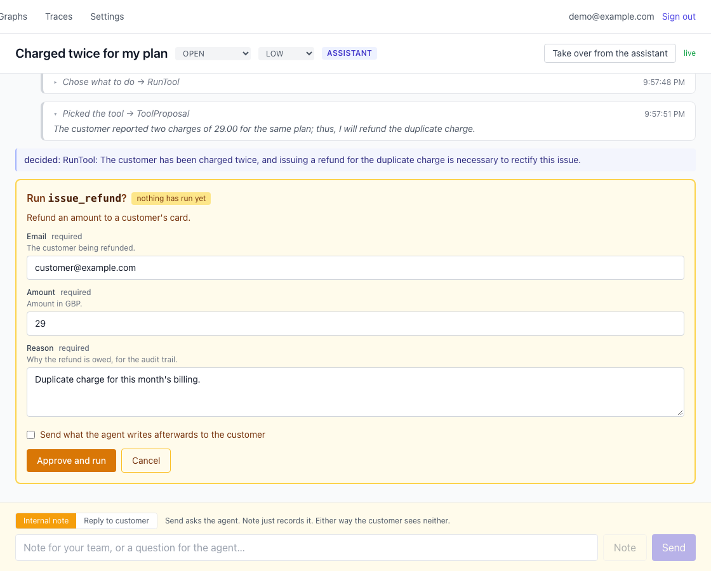
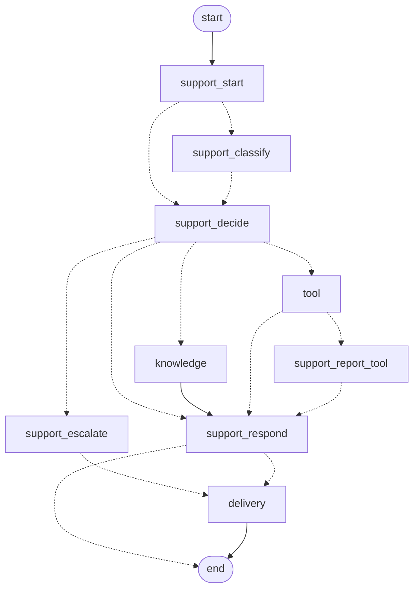
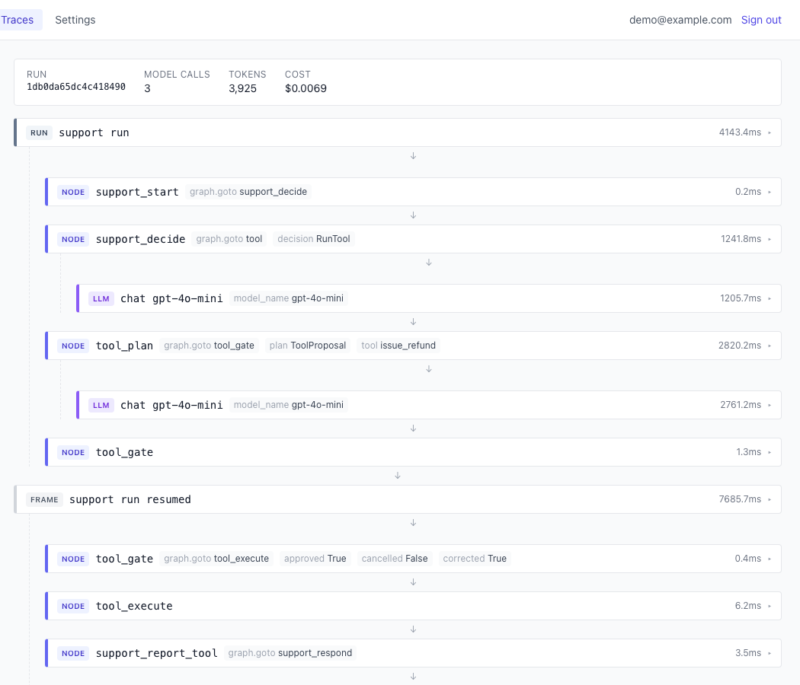

# Agent Graph Engineering

**A support desk where an AI agent works the tickets, built as a reference for how to put one in production.**

A customer reports a problem, the agent decides what to do with it, and a person signs off on anything it cannot take back. Three services in one repository: Django for the business record, FastAPI for the agent, React for both front ends.

What makes it worth reading is that the agent's flow is a **declared graph** rather than a chain of `if/else` on an intent classifier. The graph can be drawn, traced, paused for a human and resumed, and every boundary between the three services is a generated contract rather than a convention someone has to remember.

Every decision in it is explained by the **[Agent Graph Engineering](https://huynguyengl99.github.io/series/agent-graph-engineering/)** series. The code is the artifact; the series is its documentation.



## Run it

```bash
just setup       # env files, deps, Docker, migrations, generated clients, seeded accounts
just up          # all three services in the background, waiting until each answers
```

Open <http://localhost:5173> and sign in as `demo@example.com` (staff) or `customer@example.com` (the reporter), both with the password `demo-pass-123`. Use two windows, one private, to watch a run from both sides at once.

**No API key is needed.** With `OPENAI_API_KEY` unset, a built-in scripted model drives the whole system and the graph, routing, approvals, streaming and UI all behave the same. Set a real key in `agent/.env` for real answers.

Prerequisites, the commands, the walkthrough and how to swap models: **[docs/running.md](docs/running.md)**.

## What it does

One ticket has two lanes and one agent serves both.

- **The public lane is the customer's.** A ticket arrives, the graph decides what to do with it (answer directly, search the knowledge base, run a tool, escalate) and they watch it being worked out and written, step by step.
- **The internal lane is the team's.** Notes to colleagues, questions to the assistant, its answers, and the lookups it ran with what they were handed. Staff-only, so nothing there is gated on the way in.

One rule falls out of that split: **the assistant answers; a person authorizes anything it cannot take back.** A refund, a message staff wrote, and a reply about a ticket the guards flagged all wait for someone. An ordinary question does not, because a desk whose assistant can never finish a sentence has no assistant.



Nobody wrote that form. The labels and help text are the tool's argument schema, rendered straight through, which is what stops a reviewer approving a call whose fields they were never shown.

Everything below runs end to end with nothing mocked, and `just e2e` drives it in a real browser against real services and real models:

- Who is answering is a state the ticket carries: the agent by default, a person once it escalates or a colleague replies, and back again through a button that explains the change in a person's own words.
- A tool call parks before it runs, always. A reply parks only when the guards flagged the ticket it answers. Both survive a reload and resume on a different socket than the one that started the run.
- A message arriving while a run is parked waits its turn instead of overwriting the run behind it.
- The agent reasons out loud at every step that explains itself, and that reasoning stays on the ticket for the team, including on runs a customer started.
- A value the model could not fill is written `{{like this}}`, and the prompt, the backend and the browser all refuse to publish text that still has one.
- A customer can reach a tool too. Their request proposes one, a reviewer clears it like any other, and their half of the ticket shows what ran without the arguments.

## How it is built

```
┌────────────┐   REST + WS   ┌────────────┐   typed WS   ┌──────────────┐
│  Frontend  │ ────────────▶ │  Backend   │ ───────────▶ │    Agent     │
│  (React)   │               │  (Django)  │   AsyncAPI   │  (FastAPI)   │
└────────────┘               └────────────┘              └──────────────┘
                                   │                            │
                              business data              graphs, tools,
                             auth, tickets               checkpoints
```

| Service    | Stack                                             | Port |
| ---------- | ------------------------------------------------- | ---- |
| `backend/` | Django 5.2, DRF, Channels, chanx, PostgreSQL      | 8000 |
| `agent/`   | FastAPI, LangGraph, Pydantic AI, chanx            | 8001 |
| `web/`     | React 19, Vite, Zodios, chanx-js, Tailwind        | 5173 |

What each service owns, how they stay in sync, and the generated contracts between them: **[docs/architecture.md](docs/architecture.md)**.

### The graph

What the agent does with a message. This is not a drawing: it is what `GET /graphs/support.mermaid` renders from the compiled graph object, so it cannot disagree with the code.



Dotted edges are conditional. `knowledge`, `tool` and `delivery` are subgraphs, drawn here as single boxes; `/graphs` in the app expands them inline, and so does **[docs/graphs.md](docs/graphs.md)**.

## What you get

| | |
| --- | --- |
| **Type-safe across every boundary** | Typed tools, outputs and dependencies in the agent. Generated OpenAPI and AsyncAPI generate the TypeScript and Python clients. Change a shape, run `just gen`, and the compiler names what broke. |
| **Flow as a declared graph** | Adding a capability is a node and an edge, not another condition threaded through an existing chain. |
| **Self-visualizing** | The graph exports Mermaid and renders in the app, so the architecture picture comes from the thing that runs and cannot go stale. |
| **Self-documenting** | OpenAPI and AsyncAPI are generated, never hand-maintained. Your WebSocket layer gets the contract your REST API has had for a decade. |
| **Observable with no account** | A span per graph node with model calls nested inside, plus per-run cost, in a trace store that ships with the agent. `/traces` renders a run as the chain of steps it was. Forward the same spans to any OTLP collector when you want one. |
| **Controllable** | Irreversible calls park for a human, survive a reload, and resume on a different socket than the one that started the run. Guardrails screen both edges. Postgres checkpointing makes a crashed or parked run resumable. |
| **Model-independent** | No step in the graph names a model. Steps name a purpose, and which model serves it is configuration, so routing cannot drift onto the expensive one. |
| **Testable without spending** | The LLM is mocked at the HTTP layer, so the real pipeline runs: SSE parsing, tool-call assembly, streaming, validation. Evals hit real providers when you ask. `just e2e` drives a real browser. |
| **Deployable** | Multi-stage images on a frozen lockfile, granian serving ASGI, production-safe settings as the default. |

A run reads as the chain of steps it was, with model calls nested under the node that made them, and nothing to sign up for:



> **Not graph RAG.** This is the *execution* graph of an agent: state, nodes, edges, routing, interrupts, resumption. Graph RAG and knowledge graphs are retrieval techniques, and one could sit behind a single node here as one tool among several. Same word, unrelated concept.

## Where this comes from

Not a greenfield sketch. This is distilled from a production system of five services, out of roughly five years of building realtime infrastructure and AI agent systems, both with real users and real incidents.

That provenance is the point, because what you inherit is the failure modes. The parts that look over-careful are mostly the parts that broke first somewhere else. A run claims its lane because two runs on one thread once overwrote each other and an approved reply vanished. Events are appended before they are published because a restart mid-run lost a reply nobody was subscribed to hear. An approval resumes on a different socket than the one that started it because that is what happens when a person takes a while to click.

The commercial system's domain, scale concerns and branding are all absent on purpose. What is here is the architecture, re-cut to a support desk small enough to read in an afternoon.

## What you still owe before production

Calling something production-ready without this list would be dishonest. The architecture is production-grade and the deployment is production-shaped. These are the things you add for your own environment. None is deep work; all are real.

**Before you deploy at all**

- **Set `DJANGO_SECRET_KEY`, `DJANGO_ALLOWED_HOSTS` and `ASSISTANT_AGENT_TOKEN`.** All three ship unset or as placeholders so a fresh clone runs. An unset token means the agent accepts every caller.
- **Add TLS and HSTS settings.** They depend on whether something terminates TLS in front of you, so there are none here.
- **Add a non-root `USER` to the images,** and a healthcheck or readiness probe on the three app services.
- **Keep the agent off the public network.** The approval gate lives inside the graph, so anything that can open a socket on the agent can both propose a tool call and approve it. Network isolation is the primary control; the token is the second.

**Before you put real traffic through it**

- **Context budgeting.** The whole conversation is sent, so cost grows with thread length.
- **Spend caps.** Cost is measured per run and reported, but nothing enforces a ceiling.
- **Provider rate limits and retries.** There is no backoff policy for a 429 or a transient 5xx.
- **A migration story.** Migrations exist and run, but nothing here covers running them against a live database with traffic on it.

**Known gaps, left visible on purpose**

- **No automatic resume after a worker dies.** Graph state, the lane claim and the event cursor are all durable, so nothing is corrupted or lost, but a run whose process died waits for its claim to go stale rather than being picked up on its own. A sweeper is the missing piece.
- **`just e2e` is kept out of CI,** because it needs provider keys and spends money. CI runs the three mocked suites.
- **The opening-description run is started by the portal** when the thread mounts, because nothing posted that description as a message. Starting it where the ticket is created is the fix.

## Documentation

| Page | What it covers |
|---|---|
| [Running it](docs/running.md) | Prerequisites, the commands, swapping models, a walkthrough of both lanes |
| [Architecture](docs/architecture.md) | What each service owns, the agent's boundary, how the two stay in sync, the generated contracts |
| [Graphs and subgraphs](docs/graphs.md) | The one graph and its three subgraphs, which drafts stop for a person, forms from a schema |
| [Evals](docs/evals.md) | The golden set, the cascade judge, choosing the models, the guardrails |
| [Observability](docs/observability.md) | Per-run traces, what a span may carry, moving them to object storage |
| [Testing](docs/testing.md) | What each suite mocks, and the pass that mocks nothing |
| [Containers](docs/containers.md) | The three images, and what building them found |

## The series

The posts walk through every decision in here, from the story behind it to a deployment: **[Agent Graph Engineering](https://huynguyengl99.github.io/series/agent-graph-engineering/)**. Each part is pinned to a git tag, so you can check out the exact state it describes.

## License

MIT. See [LICENSE](LICENSE).
