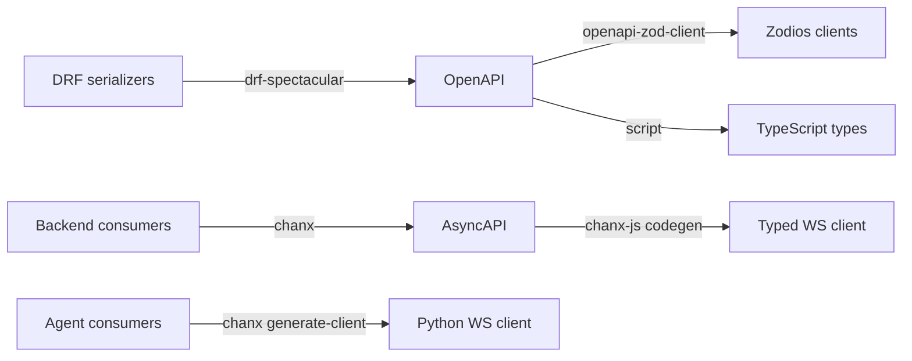

# Agent Graph Engineering

Companion repository for the **[Agent Graph Engineering](https://huynguyengl99.github.io/posts/agent-graph-engineering/the-stack-and-why-each-piece-is-there/)** blog series: building a typed, observable, controllable AI agent system with LangGraph, Pydantic AI, and chanx.

The series argues that your agent flow should be a **declared graph**, not a chain of `if/else` on an intent classifier. This repo is the working proof.

## What it is

A support desk with two surfaces that share one agent service:

- **The ticket thread** is customer-visible. A ticket arrives, the graph decides what to do with it - answer directly, search the knowledge base, escalate, or draft a reply - and posting that reply to the customer requires human approval.
- **The assistant chat** is the support agent's own. They can ask it anything, it answers freely with streaming, and nothing reaches a customer until they explicitly send a draft to a ticket, where the approval gate still applies.

One rule falls out of that split: **inside the conversation the assistant acts freely; leaving it requires a human.**

The domain was chosen so that the graph earns its place (real routing, not a two-node demo), the approval machinery solves a real problem (an irreversible action), and you can run the whole thing with only an LLM key. No OAuth, no third-party signups. With no key at all it still runs end to end on a scripted model, streaming included.

## Architecture

```
┌────────────┐   REST + WS   ┌────────────┐   typed WS   ┌──────────────┐
│  Frontend  │ ────────────▶ │  Backend   │ ───────────▶ │    Agent     │
│  (React)   │               │  (Django)  │   AsyncAPI   │  (FastAPI)   │
└────────────┘               └────────────┘              └──────────────┘
                                   │                            │
                              business data              graphs, tools,
                             auth, tickets               checkpoints
```

| Service    | Stack                                             | Port |
| ---------- | ------------------------------------------------- | ---- |
| `backend/` | Django 5.2, DRF, Channels, chanx, PostgreSQL      | 8000 |
| `agent/`   | FastAPI, LangGraph, Pydantic AI, chanx            | 8001 |
| `web/`     | React 19, Vite, Zodios, chanx-js, Tailwind        | 5173 |

The backend owns users, tickets, conversations, and history. The agent service owns the graphs, the tools, and the checkpoints.

Every browser tab holds **one** WebSocket at `/ws/`. Tickets and conversations are *topics* on it, addressed per frame, so watching four resources is one connection rather than four. Publishing needs no consumer instance: `Topic.broadcast` is a classmethod, which is what a background task driving the agent requires.

## A note on the agent's boundary

The agent is internal: only the backend connects to it, never a browser. The
approval gate lives inside the graph, so anything that can open `/ws/chat` can
propose a tool call *and* approve it - network isolation is the primary control
and `ASSISTANT_AGENT_TOKEN` is the second. Unset means the agent accepts every
caller, which is why a fresh clone runs without one.

## Everything is a generated contract

This is the core pattern, and the reason the three services can change independently without drifting apart:



Change a serializer or a WebSocket message, run `just gen`, and the compiler tells the frontend what broke. Your REST API has had this via OpenAPI for a decade. There is no reason your agent layer should not.

The backend models ticket activity as a **polymorphic** `TicketEvent` (`CommentEvent`, `StatusChangeEvent`, `AssignmentEvent`, `AIResponseEvent`), which surfaces in OpenAPI as a discriminated union and reaches the frontend as a TypeScript discriminated union. Adding an event type is one model, one serializer, one mapping entry, and a regeneration.

## Following along with the series

The series runs in tracks, and each post is pinned to a tag so you can check out the exact state being described:

| Track                | Tags                                                                              |
| -------------------- | --------------------------------------------------------------------------------- |
| Foundations          | `foundations-stack`, `foundations-types`                                           |
| Agent engineering    | `agent-typed`, `agent-prompts`, `agent-history`, `agent-tools`, `agent-routing`     |
| Graph flow           | `graph-basics`, `graph-state`, `graph-persistence`, `graph-interrupts`, `graph-subgraphs` |
| Realtime             | `realtime-websocket`, `realtime-streaming`, `realtime-scaling`                     |
| Contract             | `contract-schemas`, `contract-codegen`                                             |
| Auto UI from schema  | `ui-from-schema`                                                                   |
| Observability        | `observability-tracing`                                                            |
| Testing & evaluation | `testing-mocked-llm`, `evals-real-models`                                          |

```bash
git checkout graph-interrupts
```

`main` is always the latest state, and will be ahead of whatever post you are reading.

## Quick start

### Prerequisites

- Python 3.13+ with [uv](https://docs.astral.sh/uv/)
- Node.js 20+ with [pnpm](https://pnpm.io/)
- Docker and Docker Compose (PostgreSQL + Redis)
- [just](https://github.com/casey/just) (`brew install just`)

No API key is required to run it. With `OPENAI_API_KEY` unset the agent uses a
built-in scripted model: the graph, routing, streaming, and UI behave exactly
the same, only the reasoning is canned. Set a real key to get real answers.

### Setup

```bash
just setup           # .env, deps, Docker, migrations, generated clients
just createsuperuser
```

`just setup` writes `.env` from `.env.example` if you have none, and waits for
Postgres to accept connections before migrating. Set `OPENAI_API_KEY` in `.env`
when you want real answers.

### Run

```bash
just up          # all three, in the background, waiting until each answers
just status      # which are up
just logs a      # follow one of them (b backend, a agent, w web)
just down        # stop them and free the ports
```

Or one per terminal, when you are working on that service and want its output
in front of you:

```bash
just backend     # http://localhost:8000
just agent       # http://localhost:8001
just frontend    # http://localhost:5173
```

Backend endpoints:

- API: http://localhost:8000/api/
- Admin: http://localhost:8000/admin/
- Swagger UI: http://localhost:8000/api/schema/swg/
- AsyncAPI docs: http://localhost:8000/api/asyncapi/docs/

### Regenerate clients after a contract change

```bash
just gen               # everything
just gen-frontend      # OpenAPI + AsyncAPI to TypeScript
just gen-agent-client  # agent AsyncAPI to Python client
```

Each generator reads a live schema, so it starts the service it reads from if
that service is not already up.

## Testing

```bash
just test    # backend, agent, and web suites
just check   # every project's checks in parallel
just fix     # the same set, writing the fixes it can
```

`just check` runs twelve checks at once and prints a summary, then the output of
only the ones that failed - a change that breaks two projects should not take
two runs to find. `just check ba` narrows it to the backend and the agent, and
`just check -e w` excludes the web app.

Python is checked twice, by mypy and by pyright, because they disagree
usefully: mypy understands Django through django-stubs, and pyright caught a
non-exhaustive `match` and a dead function that mypy passed over. Each one's
config turns off the rules that report the framework rather than this code.

Agent tests mock the LLM at the HTTP layer rather than stubbing Pydantic AI, so the real pipeline runs: SSE parsing, tool call assembly, streaming, and validation. Web tests swap only the socket, through chanx-js's `socketFactory`, so the client's framing and routing run for real. Evals against real models live separately and never run in CI, because they cost money.

## Status

Work in progress, tracking the series as it publishes.

Working end to end, with nothing mocked in `just e2e`:

- **Triage.** A comment in the browser is persisted, fanned out over the ticket
  channel, handed to the agent over a typed WebSocket, and the classification
  and routing decision stream back live.
- **Two human gates.** A drafted reply parks before it reaches a customer; a
  tool call parks before it runs. Both survive a reload, and both resume on a
  different socket than the one that started the run.
- **The rep's own thread.** Routes, consults the knowledge base, or proposes a
  tool, streaming the answer as it is produced.
- Postgres checkpointing, at-most-once execution for irreversible tools,
  guardrails on both sides of the model, evals, and per-run tracing.

Not built yet: a trace viewer in the product (the tree is `GET /traces/{run_id}`
and nothing renders it), context budgeting for long conversations, and spend
caps - cost is measured, not enforced.

## Graphs and subgraphs

Five graphs, three of them composed into a parent as nodes:

| Graph | Kind | Why |
|---|---|---|
| `triage` | parent | classify, decide, answer or escalate |
| `chat` | parent | the rep's own thread: routes, looks things up, then answers |
| `knowledge` | subgraph | it loops, and both parents compose it |
| `delivery` | subgraph | the only route to a customer, and the only irreversible step |
| `tool` | subgraph | propose a tool, clear it with a human, then run it |

`GET /graphs/triage.mermaid` renders the graph **from the compiled object**, so
the picture cannot disagree with the code. `xray=true` (the default) expands
the subgraphs inline; `xray=false` shows them as single boxes. The UI renders
these at `/graphs`.

## End-to-end

```bash
just e2e-seed   # a user and some tickets
just e2e        # with all three services running
```

One pass through the product with **nothing mocked**: real Django, real agent,
real models, real browser. Kept out of `just test` because it writes to the dev
database and spends tokens.

It earns its place by catching what the mocked suites structurally cannot - a
Zodios client that threw on import, a create endpoint that returned no `id`,
a dependency upgrade that changed how models are constructed. Run it after any
of those.

## Human in the loop

Two things wait for a person, for different reasons.

A **drafted reply** parks at `delivery.await_approval`: the reviewer can edit
the text, approve, or reject, and nothing reaches the customer until they do.

A **tool call** parks at `tool.gate` *before it runs*. The reviewer sees the
tool and the arguments the model chose, and can approve, **correct the
arguments**, or cancel - correcting £29 to £9 means £9 is what gets refunded.
Underneath, `@wrap_tool` refuses an approval-marked tool that arrives without
`approved=True`, so a mis-wired graph fails closed rather than spending money.

Approval is not the end of the risk. LangGraph checkpoints *after* a node
returns, so a process killed mid-refund re-runs that node on resume and refunds
twice. A ledger keyed on the thread and the checkpoint namespace claims the call
before it is made and records the result after, so the second attempt returns the
first one's result. If the process dies between those two, nobody can know
whether the money moved, so the run says exactly that and asks a person to check
rather than guessing.

## Forms generated from a schema

One form engine, two sources of schema. The REST schemas are already Zod,
generated from the OpenAPI document. A tool's arguments arrive over the
WebSocket as JSON Schema, derived by the agent from the function's own
signature, and `lib/zodFromJsonSchema` converts them. `AutoForm` reads either
one for its fields, their types, which are required, their defaults and their
validation, so a form cannot ask for something the server or the tool will
reject.

That is what makes the tool gate work for a tool nobody wrote a form for: add a
tool to the agent and it is reviewable on its next proposal. The same engine
renders ticket creation and the model preferences at `/settings`, from
`TicketCreateRequest` and `ModelPreferenceRequest`.

## Choosing the models

Purposes are system config and the models filling them are user config, which
is what keeps provider independence real rather than theoretical. `/settings`
writes a preference per purpose; unset purposes fall through to the
deployment default. `provider:name` is validated server-side, and the field
error lands on the field.

## Guardrails

Two guards with different jobs, both in `agent/assistant/guardrails/`:

- **Input.** Customer-written ticket fields are fenced as data with an explicit "never as instructions" boundary, and the fence is stripped from the text so it cannot be closed from inside. Known injection shapes are *recorded, never blocked* - a desk that refuses tickets containing "ignore" is broken, and a warning everyone learns to skip is worse than none.
- **Output.** A `screen` node between the drafted answer and the approval gate. A leaked credential, another ticket's id, or the prompt recited back stops the draft before a reviewer is asked. A machine check ahead of the human one.

## Evals

```bash
just evals                              # the whole golden set
just evals guardrail                    # names matching "guardrail"
just evals-compare scripted openai_gpt-4o
```

Scenarios live in `agent/evals/scenarios/*.yaml`. Deterministic checks decide by majority across trials; prose criteria go to a cascade judge that runs free substring checks first and a model only when it must.

It runs with **no API key**: the scripted model keeps the deterministic checks real, unassessed criteria are reported as *skipped* rather than scored, and runs are labelled by the model that actually ran. Cost comes from the spans the tracer already collects, and a model with no price table reports its tokens with `priced: false` rather than a misleading $0.00.

## Observability

Every graph node opens a span and Pydantic AI nests its model calls underneath, so `GET /traces/{run_id}` returns the tree for one run plus what it cost. Set `OTEL_EXPORTER_OTLP_ENDPOINT` to forward the same spans to Langfuse, Jaeger, or any OTLP collector - there is a test with a fake collector proving the request lands with its auth header intact.

## License

MIT
