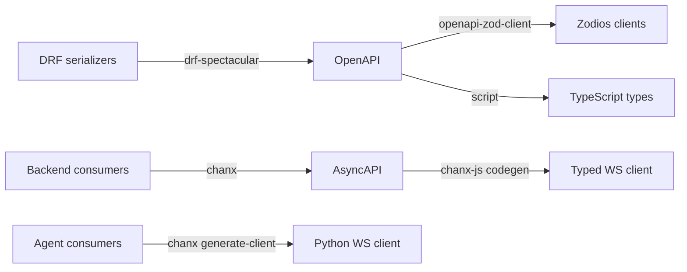

# Architecture

Where each thing is kept, and which direction updates travel. The diagram and
the service table are in the [README](../README.md).

The backend owns users, tickets, and the thread as a person reads it. The agent service owns the graphs, the tools, the checkpoints, and the thread as the *model* remembers it - Pydantic AI's own message history, which is not the same thing as a list of rows and is why both exist.

Every browser tab holds **one** WebSocket at `/ws/`. Each ticket is a *topic* on it, addressed per frame, so watching four tickets is one connection rather than four. Publishing needs no consumer instance: `Topic.broadcast` is a classmethod, which is what a background task driving the agent requires.

## A note on the agent's boundary

The agent is internal: only the backend connects to it, never a browser. The
approval gate lives inside the graph, so anything that can open `/ws/` on the
agent can propose a tool call *and* approve it - network isolation is the primary control
and `ASSISTANT_AGENT_TOKEN` is the second. Unset means the agent accepts every
caller, which is why a fresh clone runs without one.

## How the two services stay in sync

Neither service mirrors the other. They hold different things, and only one
direction carries updates.

The agent owns **execution** state: which node runs next, the channel values, the
pending interrupt payload. That is a LangGraph checkpoint in Postgres, and it is
the only reason a resume works - rebuilding it by hand would mean reimplementing
the execution model.

The backend owns the **record**: messages, ticket events, and the two things a
reload needs to find - a drafted reply waiting for approval, and a proposed tool
call. Neither is a copy of graph state. They exist because the browser cannot ask
the agent what is waiting, and because a `PendingApproval` row is what rebuilds
the approval card after a refresh.

Updates travel one way. A node broadcasts an event on its topic, the backend is
subscribed, and its relay does two things with each one: writes what belongs in
the record, and fans it out to the browser group. So the backend learns what
happened by being told, not by reading the agent's tables, and the agent never
writes to the backend's.

Two consequences worth knowing:

- **The record is derived, so it can lag but not diverge.** A terminal event
  persists the turn; a parked run persists the card. A tool proposal is
  deliberately not a turn, because it only becomes one if it runs.
- **The browser merges the two sources, by id.** A tab builds its timeline from
  the page load and the live feed at once, and the socket subscribes before the
  fetch resolves - so appending whatever arrives and replacing on load is wrong
  in both directions: an event in that window renders twice, and a snapshot
  taken a moment earlier drops it. At-most-once on the server does not make the
  client idempotent; `lib/eventList.ts` is what does.
- **One run at a time per lane.** The agent keys its checkpoint on the ticket
  and the audience, so two runs in one lane are two graphs writing one thread
  and the second wins. That is how an approved reply could vanish: a run parked
  at the gate, a message a moment later started another, and approve resumed a
  thread whose interrupt had been overwritten. A run now claims its lane and
  holds the claim through a park, because waiting for a person is not being
  finished; whatever arrives behind it is run when the claim is released rather
  than dropped. A claim older than `AGENT_RUN_CLAIM_TIMEOUT` is taken over, so
  a worker killed mid-run cannot shut a lane for good.
- **A missed event is asked for again.** A broadcast reaches whoever is subscribed
  at the time, so a restart mid-run used to leave a recoverable run and a message
  that never arrived. The agent now appends every event before publishing it and
  publishes the sequence it was stored at; the backend remembers the last sequence
  whose effect is durable, and asks for the rest when it subscribes. A replay
  starts *after* the cursor, which is what stops an event being applied twice, and
  the cursor moves in the same transaction as the row it records so a crash
  between the two cannot duplicate a reply.

## Everything is a generated contract

This is the core pattern, and the reason the three services can change independently without drifting apart:

Change a serializer or a WebSocket message, run `just gen`, and the compiler tells the frontend what broke. Your REST API has had this via OpenAPI for a decade. There is no reason your agent layer should not.

The backend models ticket activity as a **polymorphic** `TicketEvent` (`CommentEvent`, `StatusChangeEvent`, `AssignmentEvent`, `AIResponseEvent`), which surfaces in OpenAPI as a discriminated union and reaches the frontend as a TypeScript discriminated union. Adding an event type is one model, one serializer, one mapping entry, and a regeneration.
