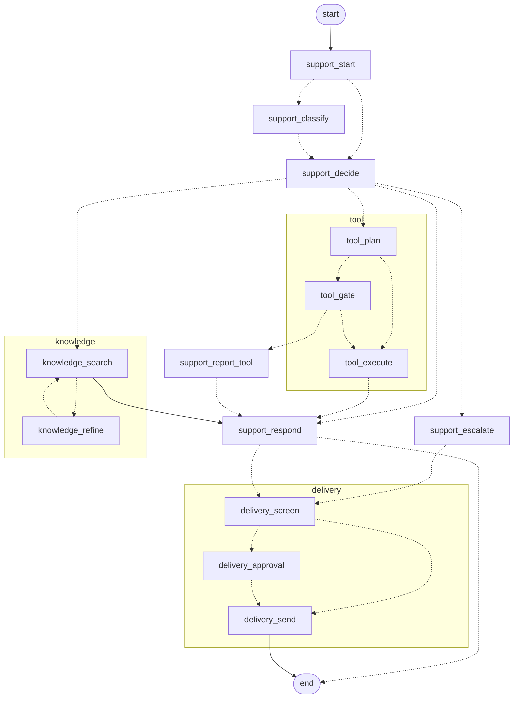

# Graphs and subgraphs

One parent and three subgraphs composed into it as nodes:

| Graph | Kind | Why |
|---|---|---|
| `support` | parent | one message worked to an answer, for whoever is reading |
| `knowledge` | subgraph | it loops, and it is reached from more than one branch |
| `delivery` | subgraph | the only route to a customer, and the only irreversible step |
| `tool` | subgraph | propose a tool, clear it with a human, then run it |

It used to be two parents - `triage` for the customer and `chat` for the team -
which classified or routed, reached for the same knowledge base, and settled on
an answer, twice, in two files of the same length. They are one graph now, and
**the audience is a field on the context** rather than a second copy of the
graph. It decides three things: whether the ticket is graded, which capabilities
the decider is even offered, and whether the reply leaves through the delivery
gate instead of going straight back.

That last point is enforced by the output schema rather than by asking the model
nicely. Answering the customer there are no tools to reach for; answering the
team there is nobody to escalate to. A branch the model cannot name is one it
cannot take.

`GET /graphs/support.mermaid` renders the graph **from the compiled object**, so
the picture cannot disagree with the code. `xray=true` (the default) expands
the subgraphs inline; `xray=false` shows them as single boxes. The UI renders
these at `/graphs`.

Expanded, with each subgraph's own start and end markers left out for
legibility:

Three things to read off it. `knowledge` loops, search to refine and back,
bounded by `KB_MAX_ATTEMPTS`. `tool` has its gate in the middle, so a proposal
reaches a person before anything runs. And `delivery` is entered from two
different places in the parent, which is why the approval logic lives there once
rather than at each call site.

## Human in the loop

Two things wait for a person, for different reasons.

A **drafted reply** parks at `delivery_approval` - but not every one, and
that is the point. Gating all of them meant the agent could never resolve a
ticket and the customer sat in front of an empty thread while the answer waited
on a screen they cannot see. `delivery.needs_a_person` decides: everything the
output screen finds is severe enough to stop a draft outright, so a finding
that survives to the gate is the *input* screen's - something in the ticket
addressed the model instead of describing a problem. That is worth a person
reading the reply, and it is rare. Every other draft is screened and sent.

The screen runs on all of them either way: `delivery` is still the only route
to `delivery_send`.

A **tool call** parks at `tool_gate` *before it runs*. The reviewer sees the
tool and the arguments the model chose, and can approve, **correct the
arguments**, or cancel - correcting £29 to £9 means £9 is what gets refunded.
Underneath, `@wrap_tool` refuses an approval-marked tool that arrives without
`approved=True`, so a mis-wired graph fails closed rather than spending money.

Approval is not the end of the risk. LangGraph checkpoints *after* a node
returns, so a process killed mid-refund re-runs that node on resume and refunds
twice. A ledger keyed on the thread and the checkpoint namespace claims the call
before it is made and records the result after, so the second attempt returns the
first one's result. If the process dies between those two, nobody can know
whether the money moved, so the run says exactly that and asks a person to check
rather than guessing.

## Forms generated from a schema

One form engine, two sources of schema. The REST schemas are already Zod,
generated from the OpenAPI document. A tool's arguments arrive over the
WebSocket as JSON Schema, derived by the agent from the function's own
signature, and `lib/zodFromJsonSchema` converts them. `AutoForm` reads either
one for its fields, their types, which are required, their defaults and their
validation, so a form cannot ask for something the server or the tool will
reject.

That is what makes the tool gate work for a tool nobody wrote a form for: add a
tool to the agent and it is reviewable on its next proposal. The same engine
renders ticket creation and the model preferences at `/settings`, from
`TicketCreateRequest` and `ModelPreferenceRequest`.
